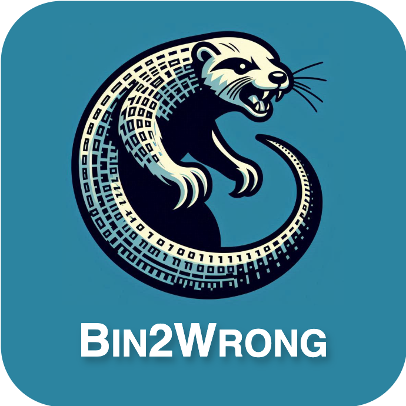

# Bin2Wrong: Fuzzing Binary Decompilers



This directory contains the source code of our tool `Bin2Wrong`: our prototype all-in-one fuzzer for finding correctness bugs in **binary-to-C decompilers**.

This work is presented in our paper [Bin2Wrong: a Unified Fuzzing Framework for Uncovering Semantic Errors in Binary-to-C Decompilers](https://futures.cs.utah.edu/papers/25ATC.pdf), appearing in the 2025 USENIX Annual Technical Conference (ATC'25).

* [Using Bin2Wrong](#using-bin2wrong)
* [Additional Notes](#additional-notes)
* [Bug Trophy Case](#bug-trophy-case)

<br>

<table>
  <tr>
    <td><b>Citing this repository:</b></td>
    <td>
      <code class="rich-diff-level-one">@inproceedings{yang:bin2wrong, title = {Bin2Wrong: a Unified Fuzzing Framework for Uncovering Semantic Errors in Binary-to-C Decompilers}, author = {Zao Yang and Stefan Nagy}, booktitle = {{USENIX} {Annual} {Technical} {Conference} ({ATC})}, year = {2025},}</code>
    </td>
  </tr>
  <tr>
    <td><b>Developers:</b></td>
    <td>Zao Yang (<a href="mailto:zao.yang@utah.edu">zao.yang@utah.edu</a>) and Stefan Nagy (<a href="mailto:snagy@cs.utah.edu">snagy@cs.utah.edu</a>)</td>
  </tr>
  <tr>
    <td><b>License:</b></td>
    <td><a href="LICENSE">MIT License</a></td>
  </tr>
  <tr>
    <td><b>Disclaimer:</b></td>
    <td>This software is provided as-is with no warranty.</td>
  </tr>
</table>


# Table of Contents
`mutation/` folder contains the source code for Bin2Wrong's program mutation/generation.

`post_decompilation/` folder contains the code for applying syntax patching to decompiled code, instrumenting code to track its global variables, and comparing the execution output between the original code and decompiled code.

`decompilers/` folder contains the instructions to set up each decompiler.

`config/` folder contains the configuration files to start fuzzing each decompiler.

`flags/` folder contains the optimization flags used for each compiler.


# Using Bin2Wrong

## 0. Install prerequisite packages
Install prerequisite packages by running `install_prereq.sh`:
```
./install_prereq.sh
```
For fuzzing Windows-only decompilers, or using MSVC as compiler, [WineHQ](https://wiki.winehq.org/Download) needs to be installed.

For fuzzing decompilers with Mach-O binaries, [OSXCross](https://github.com/tpoechtrager/osxcross) and [Darling](https://github.com/darlinghq/darling) need to be installed.

## 1. Build AFL++
Run the following commands to build AFL++:
```
cd AFLplusplus/
make distrib
sudo make install
```

## 2. Build Bin2Wrong's mutation module
Navigate to `mutation/` and run `build_mutator.sh`. This script will build the mutation module of Bin2Wrong.

After the script finishes, copy the generated mutation module file (`llvm-project/build/lib/libBin2WrongMutator.so`) to `mutation/`.

## 3. Set up the target decompiler
Follow instructions in [`decompilers/`](decompilers/README.md) to set up each decompiler.

## 4. Modify fuzzing configurations
Modify the configuration file accordingly in [configs/](configs/README.md). The configurations include the settings for AFL++, the compiler(s), the optimizations flags, and the target decompiler.

## 5. Fuzz decompilers using Bin2Wrong
Run the script to start fuzzing:
```
chmod +x run_fuzz.sh
./run_fuzz.sh [decompiler_to_be_fuzzed]
```

When there is a divergent test case found for a decompiler, Bin2Wrong will output the execution results of the original program and decompiled code in the terminal, like this:
```
Compiler used: clang                                                  
Original code output:   
i: 2 s: 321 l: 13134243432 str: another local string checksum = 901FD064                                                                                                    
Decompiled code output: 
i: 2 s: 321 l: 9876543 str: local string checksum = 42FA5691 
```

# Additional Notes
Below are instructions for extending Bin2Wrong with new features.

### Supporting New Decompilers
To test a new decompiler:

1. Add recompilation-oriented syntax patching rules in the following scripts under [`post_decompilation/`](post_decompilation/):
   - `modifiers.py`
   - `processors.py`
   - `fix_dec.py`

2. Create a new config file in the [`configs/`](configs/) directory for the decompiler.

3. Create a corresponding directory in [`fuzz_dir/`](fuzz_dir/) to store its fuzzing data.

4. Add the new fuzzing command to [`run_fuzz.sh`](run_fuzz.sh).

### Integrating New Code Mutators
Our [code mutator](mutation/src/code-mutators/CodeMutators.cpp) operates on individual AST node, applying mutations based on their AST type through corresponding `VisitASTType()` functions (e.g., `VisitForStmt()` mutates `for` statements).
- **Add new mutations for existing AST types**:  
  Modify the corresponding `VisitASTType()` function.

- **Support new AST types**:  
  Refer to the [LLVM documentation](https://clang.llvm.org/docs/IntroductionToTheClangAST.html) for supported AST node types. Implement a new `VisitASTType()` function and define mutation rules within it.

### Integrating New Compilers
To integrate support for a new compiler:

1. Extract and save the compiler's optimization flags to a text file and place it in the [`flags/`](flags/) directory.

2. Update the relevant fields of [config](configs/) files to reference the new compiler and its flags file path.

3. Modify [`run_fuzz.sh`](run_fuzz.sh) to retrieve the flags path from the config.

4. In [`CompilationMutators.cpp`](mutation/src/compilation-mutators/CompilationMutators.cpp), add logic to:
   - Get the flags file path.
   - Compile using the compiler and those flags.

# Bug Trophy Case

Bin2Wrong discovered the following bugs in mainstream binary decompilers:

| Decompiler | Reported Bugs |
| ---- | ---- |
| Angr | https://github.com/angr/angr/issues/4582, https://github.com/angr/angr/issues/4583, https://github.com/angr/angr/issues/4584, https://github.com/angr/angr/issues/4585, https://github.com/angr/angr/issues/4586, https://github.com/angr/angr/issues/4587, https://github.com/angr/angr/issues/4589, https://github.com/angr/angr/issues/4590 |
| BinaryNinja | https://github.com/Vector35/binaryninja-api/issues/5199, https://github.com/Vector35/binaryninja-api/issues/5200, https://github.com/Vector35/binaryninja-api/issues/5201, https://github.com/Vector35/binaryninja-api/issues/5202, https://github.com/Vector35/binaryninja-api/issues/5205, https://github.com/Vector35/binaryninja-api/issues/5309 |
| Radare2 | https://github.com/radareorg/r2ghidra/issues/134, https://github.com/radareorg/r2ghidra/issues/135, https://github.com/radareorg/r2ghidra/issues/136 |
| Rev.Ng | https://github.com/revng/revng-c/issues/11, https://github.com/revng/revng-c/issues/12, https://github.com/revng/revng-c/issues/15, https://github.com/revng/revng/issues/383, https://github.com/revng/revng/issues/424 |
| Reko | https://github.com/uxmal/reko/issues/1338, https://github.com/uxmal/reko/issues/1339, https://github.com/uxmal/reko/issues/1340, https://github.com/uxmal/reko/issues/1341, https://github.com/uxmal/reko/issues/1342 |

If you find new decompiler bugs using Bin2Wrong, please let us know!

# Acknowledgement

This material is based upon work supported by the National Science Foundation under Grant No. 2419798: [CICI: TCR: Practical, Systematic Fuzz Testing for Securing Scientific Software](https://www.nsf.gov/awardsearch/showAward?AWD_ID=2419798).
